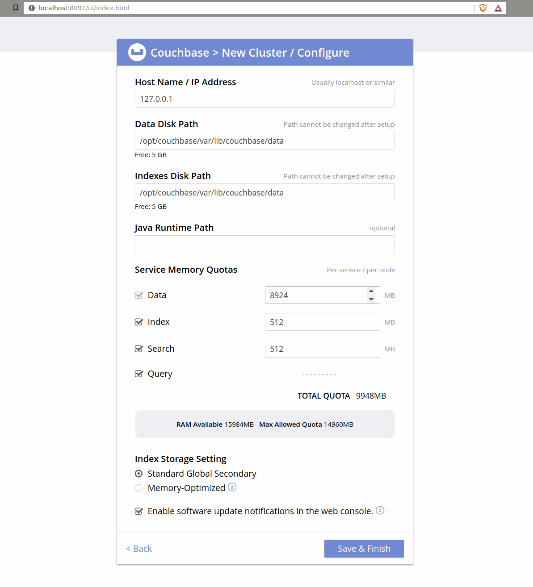
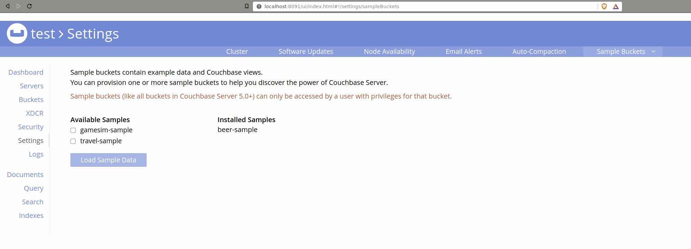

# 02 Couchbase Introduction

Couchbase has a nice introduction:

    http://hub.docker.com/r/couchbase/server

We will start off with the __Community Edition__ (6.0.0 as of the time of writing):

```bash
$ docker run --name db -p 8091-8094:8091-8094 -p 11210:11210 --rm couchbase:community-6.0.0
Unable to find image 'couchbase:community-6.0.0' locally
community-6.0.0: Pulling from library/couchbase
7b722c1070cd: Pull complete 
5fbf74db61f1: Pull complete 
ed41cb72e5c9: Pull complete 
7ea47a67709e: Pull complete 
ca04de705515: Pull complete 
90771350bcab: Pull complete 
79af75d1044c: Pull complete 
41c3df01c635: Pull complete 
e6eb0512d813: Pull complete 
3d5ef856364c: Pull complete 
52d068d8593c: Pull complete 
ed268ff62c2b: Pull complete 
61cb7b758139: Pull complete 
Digest: sha256:5aa8172f1ef8fa78bd3d0b54caefa0c691496eb3f2eceb6fac053b900aba8fca
Status: Downloaded newer image for couchbase:community-6.0.0
Starting Couchbase Server -- Web UI available at http://<ip>:8091
and logs available in /opt/couchbase/var/lib/couchbase/logs
<...>
```

[This may take some time, depending upon download speed.]

This makes the Admin UI for our Couchbase server available at:

    http://localhost:8091

It should look as follows:


We will click <kbd>Setup New Cluster</kbd>.


We will add values as shown (the password is `admin123`) and click <kbd>Next: Accept Terms</kbd>.


We will accept the terms and conditions as shown and click <kbd>Configure Disk, Memory, Services</kbd>.



We will accept the default values as shown and click <kbd>Save & Finish</kbd>.

Which should give us this spiffy dashboard:


We will click on the __sample bucket__ link, select the ___beer sample___ option and click <kbd>Load Sample Data</kbd>.

This will give rise to the following warning screen:



We will click on the __Security__ tab, and then click <kbd>ADD USER</kbd>:


And the following screen will be displayed:


We will add values as shown (the password is `test123`) and click <kbd>Add User</kbd>.

And now we can query our database
<kbd>SELECT name FROM `beer-sample` WHERE brewery_id ="mishawaka_brewing";</kbd>:


Note that the bucket is surrounded by backticks (`) and the result set is provided as [JSON](http://en.wikipedia.org/wiki/JSON).

However, we can also display our result set as a __Table__ or a __Tree__. We can also ___export___ our results as JSON.

[Unusually, __Ctrl-C__ / __Ctrl-D__ will not stop our Couchbase server. We will need to kill it from a new terminal.]
