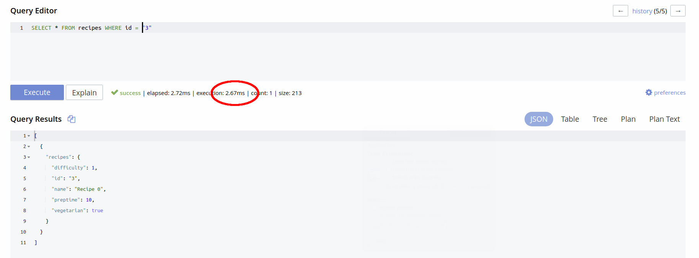
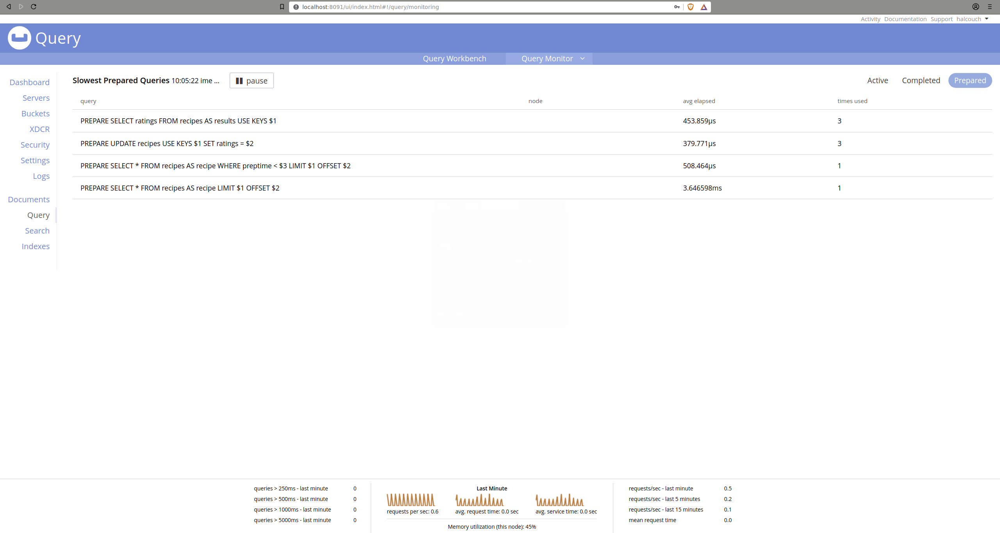

## Couchbase Performance Tips

1. [Query by KEYS rather than by id](#query-by-keys-rather-than-by-id)

2. [Specify "AdHoc(false)" to cache queries](#specify-adhocfalse-to-cache-queries)

3. [Track prepared statement performance](#track-prepared-statement-performance)

#### Query by KEYS rather than by id

Whenever possible, use the KEYS option (this doesn't even require an index) for document retrieval:


Here we can see that using the document id is slower:



#### Specify "AdHoc(false)" to cache queries

Specify that the server should cache the query plan as follows:

```Go
	listRecipesQuery := gocb.NewN1qlQuery("SELECT * FROM recipes LIMIT $1 OFFSET $2").AdHoc(false)
```

[Note that there is currently a limit of about 5,000 query plans that may be stored.]

#### Track prepared statement performance

The admin console tracks prepared statement performance, as follows:



Poorly-performing statements may need to be revised - or may benefit from new indexes.
