# RESTful Couchbase

[](http://travis-ci.org/mramshaw/RESTful-Couchbase)
[](http://codecov.io/github/mramshaw/RESTful-Couchbase?branch=master)
[](http://goreportcard.com/report/github.com/mramshaw/RESTful-Couchbase)
[](http://github.com/mramshaw/RESTful-Couchbase/releases)

An experiment with using [Couchbase](http://docs.couchbase.com/home/) as
a drop-in replacement for PostgreSQL.

## Contents

The contents are as follows:

* [Rationale](#rationale)
* [Features](#features)
* [Couchbase](#couchbase)
    * [Caveats](#caveats)
    * [Transactions, Sagas and locking](#transactions-sagas-and-locking)
    * [Getting familiar with Couchbase](#getting-familiar-with-couchbase)
* [Couchbase Performance Tips](#couchbase-performance-tips)
    * [Query by KEYS rather than by id](#query-by-keys-rather-than-by-id)
    * [Specify "AdHoc(false)" to cache queries](#specify-adhocfalse-to-cache-queries)
    * [Track prepared statement performance](#track-prepared-statement-performance)
* [Operations](#operations)
    * [To Build](#to-build)
    * [To Run](#to-run)
    * [For testing](#for-testing)
    * [See what's running](#see-whats-running)
    * [View the build and/or execution logs](#view-the-build-andor-execution-logs)
    * [To Shutdown](#to-shutdown)
    * [Clean up](#clean-up)
    * [Results](#results)
* [Versions](#versions)
* [Reference](#reference)
    * [Couchbase BLOG](#couchbase-blog)
* [To Do](#to-do)

## Rationale

This builds on my [RESTful-Recipes](https://github.com/mramshaw/RESTful-Recipes) repo,
which stores data in [PostgreSQL](https://www.postgresql.org/).

All dependencies are handled via [Docker](https://www.docker.com/products/docker) and __docker-compose__.

TDD (Test-Driven Development) is implemented; the build will fail if the tests do not pass.

Likewise the build will fail if either __golint__ or __go vet__ fails.

Enforces industry-standard __gofmt__ code formatting.

All testing can be done with [curl](CURLs.txt).

We will use parameterized N1QL to prevent SQL injection.

## Features

- uses [Gorilla MUX](http://github.com/Gorilla/mux)
- uses [Go couchbase driver](http://blog.couchbase.com/go-sdk-1.0-ga/)

## Couchbase

Couchbase is a document-oriented database based on the JSON document model.

What would be referred to as a __table__ or __row__ in a relational database
is referred to as a __document__ in Couchbase. Like other NoSQL databases,
documents may have embedded elements. In this regard, Couchbase documents are
more akin to object storage than relational database rows or records.

What would be referred to as a __database__ in a relational database seems
to be referred to as a __bucket__ in Couchbase.

Likewise, what would normally be referred to as a __server__ seems to be
referred to as a __cluster__ in Couchbase.

As with other NoSQL databases (such as DynamoDB), schemas are flexible.

Unusually, features master-master replication (all nodes are identical).

N1QL (the SQL-like Couchbase query language) operates on JSON documents,
returning JSON documents.

Similiar to __redis__ and __Cassandra__, data may be assigned arbitrary
expiry times.

Unlike __Cassandra__, Couchbase has support for __joins__.

Couchbase is packaged with an Admin Console GUI. Other NoSQL solutions
(such as MongoDB and Apache Cassandra) apparently are not packaged with
administrative consoles (although third-party consoles are available).

#### Caveats

Couchbase has a __memory-first__ architecture, which means that the results
of write operations are acknowledged when stored in memory (they are then
queued to be asynchronously written to disk and/or then replicated to another
node). So if an operation is written to memory, and the system shuts down
immediately afterwards, then that operation may not persist.

This is the __default__ behaviour, and potentially violates the __D__ of
ACID transactions. However, this behaviour can be over-ridden (at a small
performance cost) if durability requirements are critical.

Couchbase has a maximum capacity of 20 MB per document (probably not an
issue, but worth bearing in mind).

Document ids must be unique for the bucket in Couchbase (different document
types must have unique document ids). Also, each Document id (key) must be
a string in Couchbase (i.e. `"1"` instead of `1`). For this reason, it
seems to be normal practice to use a compound id (such as `user::5`); a
variation on this seems to be to embed a __type__ field within the document
(such as `"type": "user"`).

[The document id may be accessed via the document metadata: `META().id`.
 If using N1QL this value may be returned, however it is unclear to me
 how this value may be accessed from the Couchbase GOCB driver API.]

#### Transactions, Sagas and locking

Couchbase provides ACID transactions for single document operations, but multi-document transactions (or __sagas__) are not yet
natively supported (alpha third-party solutions are available).

Couchbase offers both [optimistic and pessimistic locking](http://docs.couchbase.com/go-sdk/1.5/concurrent-mutations-cluster.html).

Locking in Couchbase is implemented by CAS (Compare And Swap). This is basically a hash or digest, and will indicate if the document
in question has been mutated (if it __has__ and the CAS has been supplied, then the update will fail). Alternatively, there are
__lock__ and __unlock__ primitives (as well as __get\_and\_lock__). The lock time may be specified. Mutating the document will
also serve to unlock it.

#### Getting familiar with Couchbase

Couchbase has a nice introduction:

    http://hub.docker.com/r/couchbase/server

We will start off with the __Community Edition__ (6.0.0 as of the time of writing):

```bash
$ docker run --name db -p 8091-8094:8091-8094 -p 11210:11210 --rm couchbase:community-6.0.0
Unable to find image 'couchbase:community-6.0.0' locally
community-6.0.0: Pulling from library/couchbase
7b722c1070cd: Pull complete 
5fbf74db61f1: Pull complete 
ed41cb72e5c9: Pull complete 
7ea47a67709e: Pull complete 
ca04de705515: Pull complete 
90771350bcab: Pull complete 
79af75d1044c: Pull complete 
41c3df01c635: Pull complete 
e6eb0512d813: Pull complete 
3d5ef856364c: Pull complete 
52d068d8593c: Pull complete 
ed268ff62c2b: Pull complete 
61cb7b758139: Pull complete 
Digest: sha256:5aa8172f1ef8fa78bd3d0b54caefa0c691496eb3f2eceb6fac053b900aba8fca
Status: Downloaded newer image for couchbase:community-6.0.0
Starting Couchbase Server -- Web UI available at http://<ip>:8091
and logs available in /opt/couchbase/var/lib/couchbase/logs
<...>
```

[This may take some time, depending upon download speed.]

This makes the Admin UI for our Couchbase server available at:

    http://localhost:8091

It should look as follows:

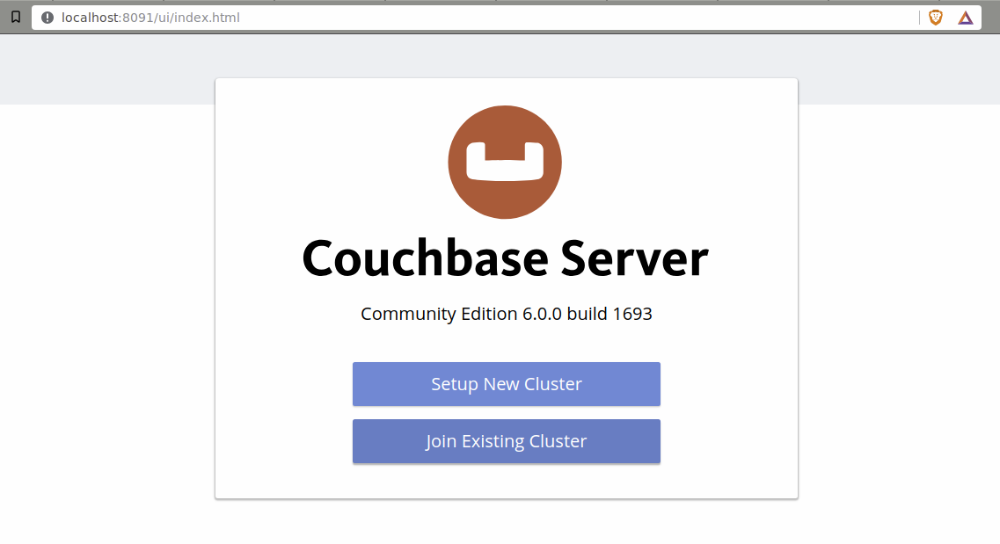

We will click <kbd>Setup New Cluster</kbd>.

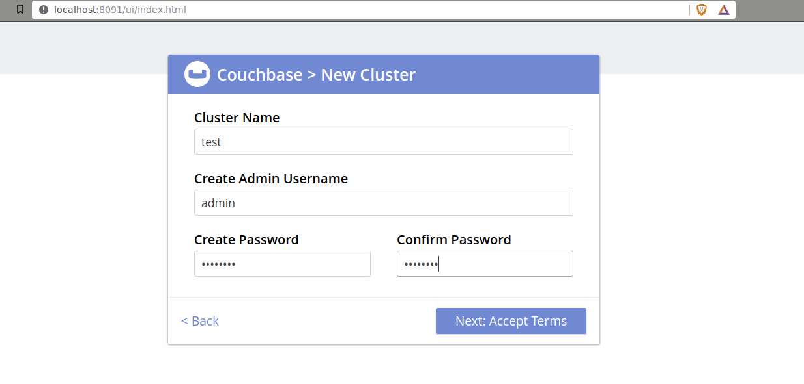

We will add values as shown (the password is `admin123`) and click <kbd>Next: Accept Terms</kbd>.

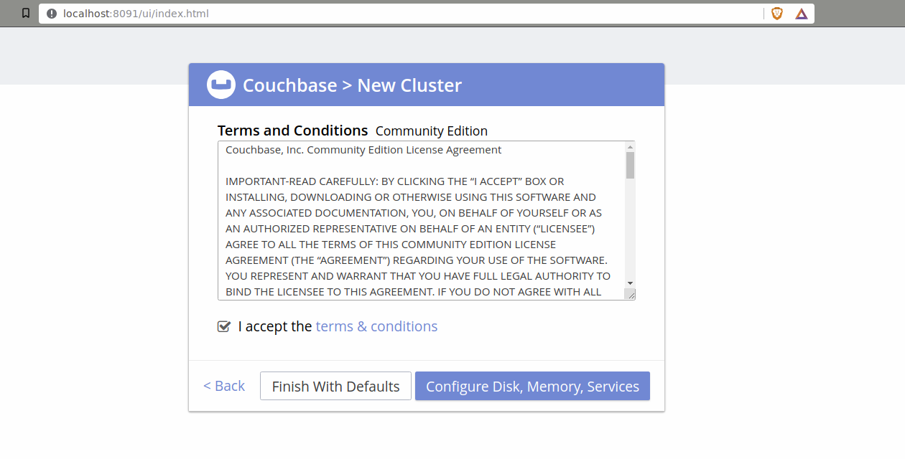

We will accept the terms and conditions as shown and click <kbd>Configure Disk, Memory, Services</kbd>.

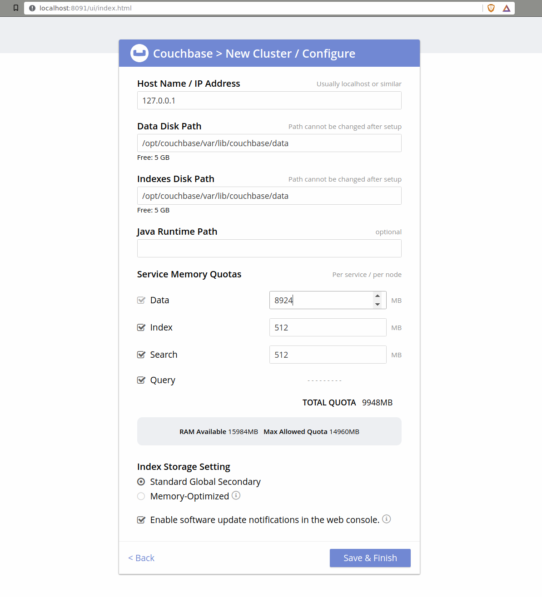

We will accept the default values as shown and click <kbd>Save & Finish</kbd>.

Which should give us this spiffy dashboard:

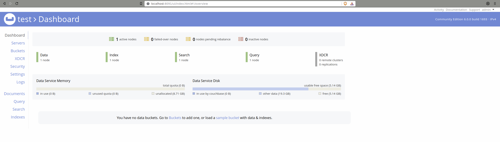

We will click on the __sample bucket__ link, select the ___beer sample___ option and click <kbd>Load Sample Data</kbd>.

This will give rise to the following warning screen:

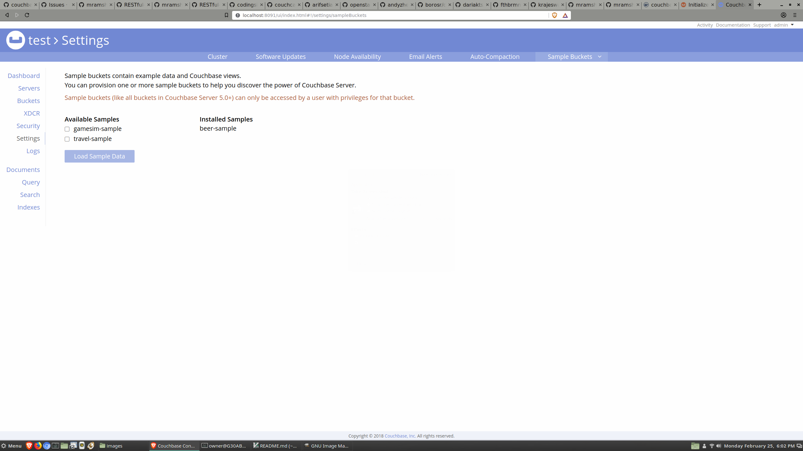

We will click on the __Security__ tab, and then click <kbd>ADD USER</kbd>:

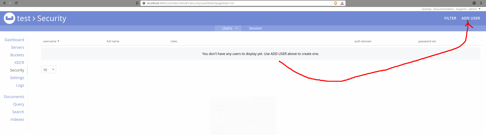

And the following screen will be displayed:

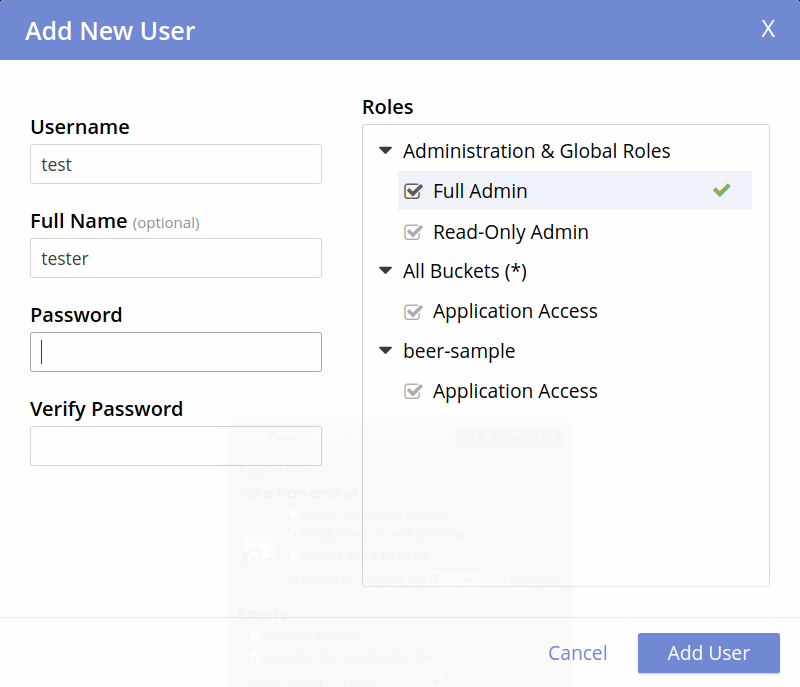

We will add values as shown (the password is `test123`) and click <kbd>Add User</kbd>.

And now we can query our database
<kbd>SELECT name FROM `beer-sample` WHERE brewery_id ="mishawaka_brewing";</kbd>:

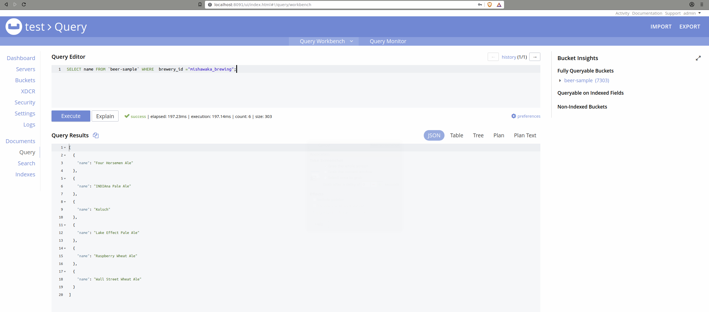

Note that the bucket is surrounded by backticks (`) and the result set is provided as [JSON](http://en.wikipedia.org/wiki/JSON).

However, we can also display our result set as a __Table__ or a __Tree__. We can also ___export___ our results as JSON.

[Unusually, __Ctrl-C__ / __Ctrl-D__ will not stop our Couchbase server. We will need to kill it from a new terminal.]

## Couchbase Performance Tips

1. [Query by KEYS rather than by id](#query-by-keys-rather-than-by-id)

2. [Specify "AdHoc(false)" to cache queries](#specify-adhocfalse-to-cache-queries)

3. [Track prepared statement performance](#track-prepared-statement-performance)

#### Query by KEYS rather than by id

Whenever possible, use the KEYS option (this doesn't even require an index) for document retrieval:

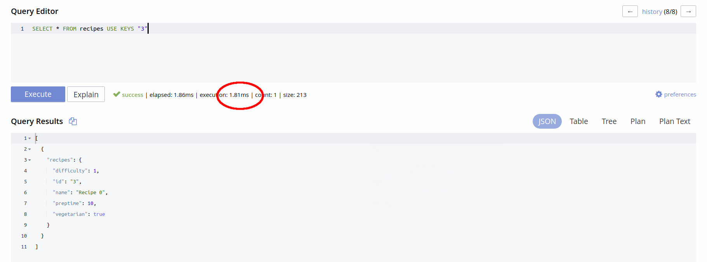

Here we can see that using the document id is slower:


#### Specify "AdHoc(false)" to cache queries

Specify that the server should cache the query plan as follows:

```Go
	listRecipesQuery := gocb.NewN1qlQuery("SELECT * FROM recipes LIMIT $1 OFFSET $2").AdHoc(false)
```

[Note that there is currently a limit of about 5,000 query plans that may be stored.]

#### Track prepared statement performance

The admin console tracks prepared statement performance, as follows:

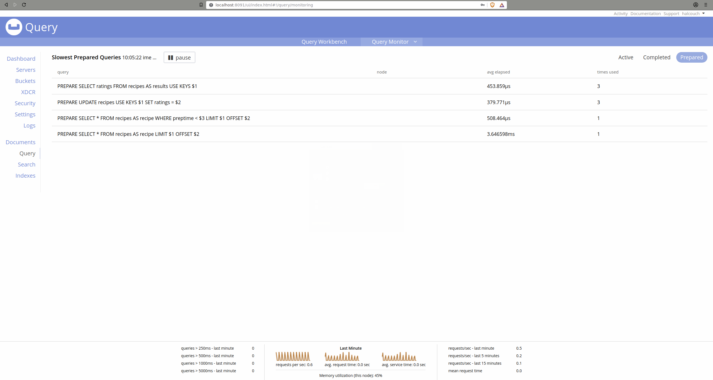

Poorly-performing statements may need to be revised - or may benefit from new indexes.

## Operations

We will use __Docker__ and __docker-compose__ to build and test our application.

#### To Build:

The command to run:

    $ docker-compose up

This should look as follows:

```bash
$ docker-compose up
Creating network "restfulcouchbase_couchnet" with the default driver
Creating restfulcouchbase_couchbase_1_d6da7719d982 ... done
Creating restfulcouchbase_golang_1_cb1241403038    ... done
Attaching to restfulcouchbase_couchbase_1_84f81eb2a871, restfulcouchbase_golang_1_6b5fa034bf5a
couchbase_1_84f81eb2a871 | + set -m
couchbase_1_84f81eb2a871 | + sleep 10
couchbase_1_84f81eb2a871 | + /entrypoint.sh couchbase-server
couchbase_1_84f81eb2a871 | Starting Couchbase Server -- Web UI available at http://<ip>:8091
couchbase_1_84f81eb2a871 | and logs available in /opt/couchbase/var/lib/couchbase/logs
couchbase_1_84f81eb2a871 | + /opt/couchbase/bin/couchbase-cli cluster-init -c localhost --cluster-username halcouch --cluster-password couchpass --services data,index,query
couchbase_1_84f81eb2a871 | SUCCESS: Cluster initialized
couchbase_1_84f81eb2a871 | + /opt/couchbase/bin/couchbase-cli bucket-create -c localhost --username halcouch --password couchpass --bucket recipes --bucket-type couchbase --bucket-ramsize 100 --enable-flush=1
couchbase_1_84f81eb2a871 | SUCCESS: Bucket created
couchbase_1_84f81eb2a871 | + fg 1
couchbase_1_84f81eb2a871 | /entrypoint.sh couchbase-server
golang_1_6b5fa034bf5a | GOPATH=/go GOOS=linux GOARCH=amd64 gofmt -d -e -s -w *.go
golang_1_6b5fa034bf5a | GOPATH=/go GOOS=linux GOARCH=amd64 gofmt -d -e -s -w application/*.go
golang_1_6b5fa034bf5a | GOPATH=/go GOOS=linux GOARCH=amd64 gofmt -d -e -s -w recipes/*.go
golang_1_6b5fa034bf5a | GOPATH=/go GOOS=linux GOARCH=amd64 gofmt -d -e -s -w test/*.go
golang_1_6b5fa034bf5a | GOPATH=/go GOOS=linux GOARCH=amd64 golint -set_exit_status *.go
golang_1_6b5fa034bf5a | GOPATH=/go GOOS=linux GOARCH=amd64 golint -set_exit_status ./...
golang_1_6b5fa034bf5a | GOPATH=/go GOOS=linux GOARCH=amd64 go tool vet *.go
golang_1_6b5fa034bf5a | GOPATH=/go GOOS=linux GOARCH=amd64 go tool vet application/*.go
golang_1_6b5fa034bf5a | GOPATH=/go GOOS=linux GOARCH=amd64 go tool vet recipes/*.go
golang_1_6b5fa034bf5a | GOPATH=/go GOOS=linux GOARCH=amd64 go tool vet test/*.go
golang_1_6b5fa034bf5a | GOPATH=/go GOOS=linux GOARCH=amd64 go test -v test
golang_1_6b5fa034bf5a | === RUN   TestEmptyTables
golang_1_6b5fa034bf5a | --- PASS: TestEmptyTables (0.55s)
golang_1_6b5fa034bf5a | === RUN   TestGetNonExistentRecipe
golang_1_6b5fa034bf5a | --- PASS: TestGetNonExistentRecipe (0.41s)
golang_1_6b5fa034bf5a | === RUN   TestCreateRecipe
golang_1_6b5fa034bf5a | --- PASS: TestCreateRecipe (0.41s)
golang_1_6b5fa034bf5a | === RUN   TestGetRecipe
golang_1_6b5fa034bf5a | --- PASS: TestGetRecipe (0.39s)
golang_1_6b5fa034bf5a | === RUN   TestUpdatePutRecipe
golang_1_6b5fa034bf5a | --- PASS: TestUpdatePutRecipe (0.37s)
golang_1_6b5fa034bf5a | === RUN   TestUpdatePatchRecipe
golang_1_6b5fa034bf5a | --- PASS: TestUpdatePatchRecipe (0.34s)
golang_1_6b5fa034bf5a | === RUN   TestDeleteRecipe
golang_1_6b5fa034bf5a | --- PASS: TestDeleteRecipe (0.37s)
golang_1_6b5fa034bf5a | === RUN   TestAddRating
golang_1_6b5fa034bf5a | --- PASS: TestAddRating (0.39s)
golang_1_6b5fa034bf5a | === RUN   TestSearch
golang_1_6b5fa034bf5a | --- PASS: TestSearch (4.43s)
golang_1_6b5fa034bf5a | PASS
golang_1_6b5fa034bf5a | ok  	test	9.691s
golang_1_6b5fa034bf5a | GOPATH=/go GOOS=linux GOARCH=amd64 go build -v -o restful_couchbase main.go
golang_1_6b5fa034bf5a | restful_couchbase has been compiled
golang_1_6b5fa034bf5a | ./restful_couchbase
golang_1_6b5fa034bf5a | 2019/03/08 19:45:44 Now serving recipes ...
```

Once `make` indicates that `restful_couchbase` has been compiled, can change `docker-compose.yml` as follows:

1) Comment `command: bash -c "sleep 15; make"`

2) Uncomment `#command: bash -c "sleep 15; ./restful_couchbase`

#### To Run

The command to run:

    $ docker-compose up -d

For the first run, there will be a warning if `mramshaw4docs/golang-couchbase:1.11` has not been built.

This image will contain all of the Go dependencies and should only need to be built once.

A successful `golang` startup should show the following as the last line of `docker-compose logs golang`:

    golang_1    | 2019/03/01 19:05:05 Now serving recipes ...

If this line does not appear, repeat the `docker-compose up -d` command (there is no penalty for this).

#### For testing:

[Optional] Start couchbase:

    $ docker-compose up -d couchbase

Start golang [if couchbase is not running, this step will start it]:

    $ docker-compose run --publish 80:8100 golang make

Successful startup will be indicated as follows:

    2019/03/01 19:05:05 Now serving recipes ...

This should make the web service available at:

    http://localhost/v1/recipes

Once the service is running, it is possible to `curl` it. Check [CURLs.txt](CURLs.txt) for examples.

#### See what's running:

The command to run:

    $ docker ps

#### View the build and/or execution logs

The command to run:

    $ docker-compose logs golang

#### To Shutdown:

The command to run:

    $ docker-compose down

Clean up docker volumes as follows:

	$ docker volume prune

#### Clean Up

The command to run:

    $ docker-compose run golang make clean

Clean up docker image as follows:

	$ docker rmi mramshaw4docs/golang-couchbase:1.11

#### Results

Due to the ad-hoc nature of NoSQL documents, the code is somewhat more complicated
than would be the case with relational databases; however as I am using Couchbase
as a drop-in replacement for PostgreSQL this is hardly a fair comparison. But for
learning the ins and outs of Couchbase, it's been a worthwhile exercise.

## Versions

* Couchbase - Community Edition - version __6.0.0__
* Docker - Community edition (Client & Server) - version __18.09.3__
* Docker-Compose __1.23.1__
* Go __1.11__

More recent versions of these components should be fine.

## Reference

Query Optimization Using Prepared (Optimized) Statements:

    http://docs.couchbase.com/go-sdk/1.5/n1ql-query.html#prepare-stmts

[My feeling is that using ___named___ parameters is more self-documenting (and may
 therefore result in fewer bugs) than using ___positional___ parameters.]

Concurrent Document Mutations:

    http://docs.couchbase.com/go-sdk/1.5/concurrent-mutations-cluster.html

#### Couchbase BLOG

For general articles on Couchbase, their [BLOG](https://blog.couchbase.com/) is the place to start.

I found the following articles useful:

    http://blog.couchbase.com/moving-from-sql-server-to-couchbase-part-1-data-modeling/

[To a large extent, the use of JSON in Couchbase removes the need for OR/M tooling.]

    http://blog.couchbase.com/sql-server-couchbase-data-migration/

[The article states there is no __date__ primitive in JSON. While this may be technically
 true, for most uses the __time__ primitive will suffice instead.]

    http://blog.couchbase.com/moving-sql-server-couchbase-app-migration/

[The article focuses on migrating from SQL Server but is useful for other databases.]

## To Do

- [x] Learn [N1QL](http://docs.couchbase.com/server/6.0/getting-started/try-a-query.html)
- [ ] Investigate using views to enforce constraints (indexes are a performance nightmare)
- [ ] Upgrade to latest release of Gaolng (__1.12__ as of the time of writing)
- [ ] Investigate the use of `n1qlResp.Metrics.MutationCount`
- [x] Add Travis CI build process & code coverage reporting
- [x] Add pessimistic locking to updates
- [ ] Update build process to `vgo`
- [ ] Add tests for data TTL
